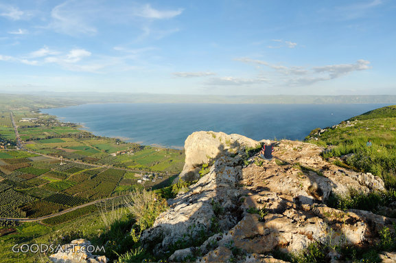
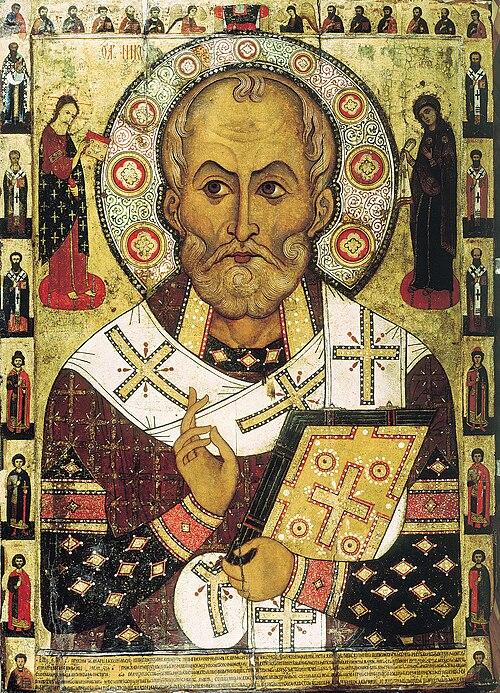

# **Kapitel 14 - Matthäus Evangelium**

1\] Zu dieser Zeit hörte Herodes (Antipas) der Tetrarch [^1] die Kunde
von Jesus. (Mk 6,14-29, Lk 9,7-9).

2\] Und er sagte zu seinen Knechten: Dies ist Johannes der Täufer. Er
ist von den Toten auferstanden, deshalb werden grosse Wunder durch ihn
bewirkt.

3\] Dieser Herodes hatte nämlich Johannes gefangen genommen, gebunden
und ins Gefängnis geworfen, wegen der Herodias [^2], der Frau seines
Bruders Phillipus.

4\] Denn Johannes hatte zu ihm gesagt: Es ist nicht autorisiert
(erlaubt), dass sie deine Frau sei.

5\] Und er wollte ihn töten,[^3] aber er fürchtete sich vor dem Volk,
denn sie betrachteten ihn als Propheten.

6\] Als der Geburtstag von Herodes kam, tanzte die Tochter[^4] der
Herodias vor den Gästen, und es gefiel Herodes.

7\] Deshalb schwor er ihr mit einem Eid, dass er ihr alles, was sie
verlangt, geben würde. (Esth. 5,6)[^5] .

8\] Sie aber, von ihrer Mutter beraten, sagte: Gib mir jetzt gleich auf
einen Tablett den Kopf von Johannes dem Täufer.

9\] Und der König [^6] war betrübt, aber wegen dem Eid und den Gästen,
befahl er, dass er ihr gegeben werde.

10\] So sandte er um Johannes im Gefängnis zu enthaupten.

11\] Und sein Kopf wurde auf einem Tablett gebracht und dem Mädchen
gegeben; und sie brachte ihn zu ihrer Mutter.

12\] Und seine Jünger kamen und sie nahmen seinen Leichnam und begruben
ihn und sie kamen und informierten Jesus.

13\] Aber Jesus, als er *das *hörte, ging Er von dort weg in einem Boot
in eine Wüstenregion; [^7] und als die Leute es hörten, folgten sie Ihm
auf dem Lande von ihren Städten aus. [^8]

14\] Und Jesus ging an Land und sah die grosse Menschenmenge und Er
wurde von liebendem Mitgefühl bewegt und heilte ihre Kranken.

15\] Und als es Abend wurde, kamen seine Jünger [^9] zu Ihm und sie
sagten zu Ihm: Dies ist ein Wüstenort, und es ist spät geworden.
Entlasse die Leute, so dass sie in die Dörfer gehen können, um Essen für
sich zu kaufen.

16\] Und Er sagte zu ihnen: Es ist nicht nötig, dass sie gehen. **Gebt
ihr ihnen zu essen.**

17\] Aber sie sagten zu ihm, wir haben nichts ausser fünf Laib Brote und
zwei Fische. [^10]

18\] Und Jesus sagt zu ihnen: Bringt sie hierher zu Mir.

19\] Und Er befahl der Menschenmenge sich auf den Boden zu setzen; und
Er nahm die fünf Brote und zwei Fische und Er schaute auf zu den
Himmeln; und Er segnete sie und Er brach sie und gab sie seinen Jüngern,
und seine Jünger legten sie vor die Leute.

20\] Und sie alle assen und wurden satt. Und sie lasen die Broken auf,
die übrig geblieben waren:

**12 Körbe voll.** [^11]

21\] Aber die Männer, die assen waren fünf Tausend, ohne Frauen und
Kinder (gezählt). [^12]

22\] Und unmittelbar danach drängte Er seine Jünger, in ein Boot zu
gehen und auf die andere Seite *(des Sees) *zu gehen, während er die
Menschenmenge entliess.

{width="9.329cm"
height="6.191cm"}23\] Und als Er die Leute weggeschickt hatte, stieg er
alleine auf einen Berg (Hügel) **um zu beten; [^13]** und als die
Dunkelheit hereinbrach, war er immer noch alleine dort.

24\] Aber das Schiff war (noch) etliche Kilometer vom Land entfernt, von
den Wellen geschlagen, den der Wind war ihm entgegen. [^14]

25\] Und um die vierte Nachtwache (3:00-6:00 Uhr) kam Jesus zu ihnen. Er
ging auf dem Wasser.

26\] Und Seine Jünger sahen Ihn auf dem Wasser gehen. Und sie erschraken
sich und sie sagten: das ist eine falsche Vision, und vor lauter Furcht
schrien sie laut.

27\] Er aber, Jesus, sprach sofort zu ihnen und sagte: Seid guten Mutes
(Herzens), **ICH BIN DER ICH BIN**, [^15] fürchtet euch nicht. (2.Mo
3,13-14; Joh 18,6)

28\] Und Kephas (Petrus) antwortete und sagte zu Ihm: Mein Herr, wenn Du
das bist, dann befiehl mir, [^16] zu Dir auf dem Wasser zu kommen.

29\] Und Jesus sagte zu ihm: Komme. So stieg Kephas aus dem Boot und
wandelte auf dem Wasser, um zu Jesus zu kommen.

30\] Aber als er den starken Wind sah, fürchtete er sich und begann zu
sinken. Und er erhob seine Stimme und sagte: Mein Herr, rette mich.
[^17]

31\] Und unser Herr streckte sofort Seine Hand aus und ergriff ihn; und
Er sagte zu ihm: O du Kleingläubiger, wieso warst du gespalten (hast du
gezweifelt)? [^18]

32\] Und sie stiegen ins Boot, und der Wind legte sich.

33\] Und die, welche im Boot waren, kamen, und beteten Ihn an. Und sie
sagten:

**Wahrlich, Du bist der Sohn Gottes. [^19]**

(Ps 2,7; 2. Sam 7,14; Ps 89,26-27; )

{width="8.786cm"
height="8.786cm"}**34\] **Und sie ruderten weiter, und kamen bei
Genezareth an Land.

35\] Und die Menschen von dieser Gegend erkannten Ihn. Und sie sandten
Kunde in alle Dörfer um sie herum, und sie brachten zu Ihm alle, die
sehr krank waren.

36\] Und sie baten Ihn, dass sie wenigstens nur den Zipfel seines
Gewandes berühren mögen, und die, welche es anrührten, wurden geheilt.
[^20]

[^1]:  Vers 1: ***Herodes der Vierfürst:***

    Nach dem Tode Herodes des Grossen (vermutlich 4 v.Chr.) wurde dessen
    Gebiet in mehrere Teile aufgeteilt und auf 3 Söhne verteilt.
    Tetrarch (Viertel-Herrscher) ist ein griechischer Amtsbegriff der
    Römer für zugeteilte Verwaltungsgebiete einer Region. Es bezieht
    sich nicht ausdrücklich auf 4 Gebiete. Judäa wurde Herodes
    **Archelaus **zugeteilt, dem Joseph bei der Rückkehr mit Baby Jesus
    aus Ägypten auswich, Archelaus hätte bei guter Regierungsführung den
    Königstitel erlangen können, hat dies aber vermasselt und wurde nach
    10 Jahren ca. 6 n.Chr. ins Exil nach Gallien geschickt.
    **Phillippus** (Vers 3) wurde Tetrach im Norden in Ituräa, Golan und
    Trachonitis (Lk 3,1) bis zu seinem Tode 34 n.Chr. .

    **Herodes Antipas **erhielt Galiläa, also das Kerngebiet von Jesus
    Wirken mit Nazareth, Kapernaum, dem See Genezareth, etc.. Antipas
    war scharf auf das Gebiet von Archelaus und wollte ihn von Anfang an
    bim Cäsar anschwärzen. Antipas herrschte bis 39 n.Chr, und wurde
    dann auch ins Exil verbannt. Er war zu fest in seine politischen
    Ränkespielchen und Extravaganzen verwickelt, als dass er sich
    ernsthaft um geistliche Werte gekümmert hätte, obwohl er
    offensichtlich an Totenauferstehung glaubte, siehe nächster Vers 2.

[^2]:  Vers 3: **Herodias** war die Tochter von Aristobus, einem anderen
    Sohn von Herodes dem Grossen. Sie heiratete also ihren Onkel
    Philippus, was Inzucht ist. Und dann beging sie Ehebruch und wurde
    die Frau ihres anderen Onkels Herodes Antipas.

    **Inzucht und Ehebruch.** Wie soll man sagen, typisch & abscheulich
    für machtgierige Politiker, damals wie heute.

[^3]:  Vers 5:* Herodes wollte ihn töten, aber er fürchtete sich vor dem
    Volk,..*

    Antipas war skrupellos aber auch feige. Viele Politiker und Menschen
    in Regierungen sind skrupellose Mörder. Es ist schwer
    nachvollziehbar, wie sich heute viele von Mainstreammedien
    gehirnwaschen lassen und dadurch fatal & blinde den Behörden und
    Regierungen vertrauen, welche durch Impfungen organisierten brutalen
    Völkermord betreiben und Menschen in unnütze Kriege zu getötet
    werden schicken. Sie kennen die Bibel nicht.

[^4]:  Vers 6: *tanzte die Tochter der Herodias.*

    Salome war die Tochter von Herodias mit Philippus. Gemäss
    Geschichtsschreiber Josephus soll auch sie einen weiteren Sohn
    Herodes des Grossen geheiratet und damit die Inzucht noch mehr
    verschlimmert haben.

[^5]:  Vers 7: *Deshalb schwor er ihr mit einem Eid, dass er ihr alles,
    was sie verlangt, geben würde.*

    Dieser hochmütige möchtegern König (seine Position konnte ihm zu
    jeder Zeit sofort vom Kaiser weggenommen werden, was dann im Jahr 39
    passierte, wo er ins Exil verbannt wurde), dieser
    grössenwahn-sinnige Herodes Antipas wollte die Geschichte vom
    grossen Weltreich Herrscher **Ahasveros** in **Esther 5,6**
    imitieren. Lies Esther Kap 5,6 bis 7,10. Nur war Esther eine edle
    Seele im Gegensatz zur Schlangenbrut Salome und Herodias. Esther bat
    um ihr Leben und das ihres Volks der Juden, welche der damalige
    Hitler (Judenmörder) Haman umbringen wollte, während diese hier
    (Herodias/Salome) den Kopf des grössten jemals geborenen Menschen
    (abgesehen von Jesus) fordern.

[^6]:  Vers 9: .. ***der König**..*

    Herodes Antipas war nicht König, sondern nur Vierfürst. Aber das
    Volk hat ihn vermutlich gewohnheitsmässig oft als König
    angesprochen, was ihm natürlich geschmeichelt hat. Das von Cäsar dem
    Vater von Antipas, Herodes dem Grossen, zugesprochene \"Königreich\"
    wurde nach dessen Tod (ca. 4 v.Chr.) in mehrere Verwaltungs - Teile
    aufgesplittet und darüber die Tetrarchen gestellt. Antipas erhielt
    nur Galiläa, nicht Judäa. Judäa kam nach der Verbannung von
    Archelaus im Jahr 6 n.Chr. unter direkte Römische Verwaltung. Zur
    Zeit von Jesus war dies Pilatus.

    Dass der Heilige Geist Matthäus erlaubt, hier \"König\" zu
    verwenden, hat eine Spur von Ironie. Jesus ist eigentlich der wahre
    König der Juden. Messias bzw. Christus ist die biblische Bezeichnung
    des Retterkönigs.

    Die Herodianer stammen von einem Überrest der Idumäer (Edomiter),
    welche von Esau abstammten. Dieser Überrest hat sich dem Überrest
    der Juden angeschlossen. Es war für Israel nicht erlaubt, einen
    Fremden über sich als König zu wählen. Die ganze Herodes Dynastie
    war quasi illegal, vom Kaiser in Rom bestimmt, nicht vom Herrn
    JaHuUaH.

    5\. Mose 17: 14 Wenn du in das Land kommst, das der HERR, dein Gott,
    dir gibt, und es in Besitz nimmst und darin wohnst und dann sagst:
    »Ich will einen König über mich setzen, wie alle Heidenvölker, die
    um mich her sind!«,

    15 so sollst du nur den zum **König über dich setzen, den der HERR,
    dein Gott, erwählen wird.** Aus der Mitte deiner Brüder sollst du
    einen König über dich setzen; du **kannst keinen Fremden über dich
    setzen,** der nicht dein Bruder ist. (Schlachter 2000)

    Dass Herodes der Grosse den Tempel gebaut hatte, konnte ihn in
    Gottes Augen nicht besser hinstellen. In Joh. 2,19 deutet Jesus den
    Juden das Ende der Steintempel Ära an, der echte Tempel ist jetzt
    der Leib des Christus gebaut mit lebendigen Steinen.

    In Matth. 24,1-2 prophezeit Jesus die Zerstörung des Tempels den
    Herodes der Grosse bauen liess.

    \--

    Falls du dich fragst, wieso ich solche Dinge so ausführlich
    beschreibe: Es ist für uns heute wichtig, sich in die damalige Zeit
    hinein versetzen zu können, also ist es wichtig, die Zeitgeschichte
    zu kennen. Dies gibt einem Wort wie \"der König\" hier in diesem
    Vers 9 ein ganz anderes Gewicht, als wenn man keine Ahnung hat. Es
    stärkt die Schärfe des Schwertes des Wortes Gottes, die Umstände zu
    verstehen, wo es gesprochen wurde.

[^7]:  Vers 13\] Herodes hat gerade den grössten jemals geborenen
    Menschen (Mt 11,11) brutal ermordet. Gott hat dies zugelassen, sogar
    während Jesus selber auf der Erde war. Jesus hat es auch nicht
    verhindert.

    Es bricht eine neue Ära an. Mt. 11,12. Das Königreich der Himmel ist
    nicht von dieser Welt, deshalb hat Gott oder Jesus nicht
    eingegriffen.

    Wir können nur erahnen, was Jesus alleine auf dem Boot mit dem
    himmlischen Vater besprochen hat. Angesichts der realen Gefahr
    musste Jesus sicherstellen, dass er nicht ausserhalb von Jerusalem
    getötet werden kann, damit er seinen wichtigsten Auftrag, die Sünden
    der Welt auf sich zu nehmen am Kreuz, zum Sieg verhelfen kann, und
    somit die Wirklichkeit des Königreichs der Himmel auf Erden
    etabliert, durch die Aussgiessung des Heiligen Geistes nach seiner
    Auferstehung und Himmelfahrt.

    In Lk 13,31-33 lässt Jesus Herodes dem Fuchs nach Morddrohungen
    ausrichten, dass es nicht möglich ist, dass Er ausserhalb von
    Jerusalem stirbt. Jesus prophezeit sein Leben gemäss dem Willen des
    Vaters, und keine irdische Macht kann dies ändern. Und Jerusalem war
    ausserhalb des Machtbereichs des Herodes Antipas.

    Wir sind also nicht schutzlos der Willkür von korrupten Mörder
    Regierungen ausgesetzt, sondern wir sollen Gottes Willen über unser
    Leben aussprechen und einfach innerhalb von Gottes Willen leben und
    um Barmherzigkeit für unsere Fehler bitten. \"Unser Vater im Himmel
    \... erlöse uns von dem Bösen \... den Dein ist das Reich. Amen.

    Jesus musste als Samenkorn am Kreuz in Jerusalem sterben, damit aus
    Ihm, dem einen Korn, die vielen Körner entstehen. *Joh 12,23-24:
    Jesus aber antwortete ihnen und sprach: Die Stunde ist gekommen,
    dass der Sohn des Menschen verherrlicht werde! 24 Wahrlich,
    wahrlich, ich sage euch: Wenn das Weizenkorn nicht in die Erde fällt
    und stirbt, so bleibt es allein; wenn es aber stirbt, so bringt es
    viel Frucht.*

    Wir, die vielen Geschwister von Jesus als der Leib Christi, die
    Ekklesia, haben nun die Vollmacht und die Schlüssel, selbst Mörder
    Regierungen wie ein Herodes zu entfernen durch Gebet. Mt 18,18-20.

    Dies ist der Vorsatz Gottes, die Ekklesia hervorzubringen und mit
    ihr seine Königsherrschaft von Jesus auf Erden zu etablieren. In
    Apostelgeschichte sehen wir dann, dass nach dem Gebet der Ekklesia
    Petrus vor der Ermordung befreit wurde und wenige Tage danach
    Herodes Agrippa, der Apostel Jakobus Mörder, von einem Engel
    geschlagen wurde und von Würmern gefressen starb.

    Es ist also nicht so, dass es Gott oder Jesus gleichgültig ist, was
    die korrupten Herrscher den Männern und Frauen Gottes und den
    gerechten Menschen antun. Aber Gott ist auf das Gebet der Ekklesia
    angewiesen, um dies machen zu können. Wir haben die Schlüssel auf
    Erden. Er hat die Schlüssel im Himmel. Beide müssen betätigt werden,
    damit Gott eingreift.

    Lies auch Eph 3,10 und 1. Kor. 15, 23.25. Mehr dazu im Buch:
    \"satans grösster Alptraum: Ekklesia, die Exekutiv-Versammlung des
    Messias Königs Jesus\".

[^8]:  Vers 13: *und als die Leute es hörten, folgten sie ihm auf dem
    Lande.*

    Die Leute lassen Jesus kaum Zeit zum Trauern oder Beten. Er musste
    alleine auf einem Boot sein, um überhaupt in der Stille sein zu
    können. Wir müssen auch oft erfinderisch und vorallem auch
    determiniert sein, um in die Stille in die Gemeinschaft mit Gott zu
    kommen.

[^9]:  Vers 15: *Und als es Abend wurde, kamen seine Jünger zu Ihm und
    sie sagten zu Ihm: Dies ist ein Wüstenort, und es ist spät geworden.
    Entlasse die Leute, so dass sie in die Dörfer gehen können, um Essen
    für sich zu kaufen. *

    Auch die Jünger sorgten sich um die Leute, aber in einer rein
    natürlichen Weise. Was Jesus im Begriff ist zu machen, zeigt die
    überragende Majestät der geistlichen Realität, der Kenntnis des
    Willens des Vaters gegenüber dem rein natürlichen menschlichen
    Sich-Sorgen und Bemühen. Jesus erwartet von uns, dass wir in diese
    Art von Geistesgegenwart hineinkommen und seine wunderbaren Werke in
    der Führung des Heiligen Geistes tun.

[^10]:  Vese 16 & 17: ***Gebt ihr ihnen zu essen**\... Wir haben nichts
    ausser 5 Brote und 2 Fische.*

    Wenn Jesus etwas Unmögliches von uns verlangt, stehen wir kurz vor
    einem Wunder.

[^11]:  Vers 20:* Und sie lasen die Broken auf, die übrig geblieben
    waren: **12 Körbe voll.** *

    Die Wunderwirkung Gottes durch die Hände des Christus überragt
    überfliessend unsere natürlichen Fähigkeiten und Begrenzungen und
    kann nebenbei auch noch geistliche Symbolik einflechten: **12**
    Körbe voll.

    Zwölf Stämme der zwölf Söhne Israels (Jakobs).

    Zwölf Apostel.

    Das Neue Jerusalem hat zwölf Tore mit den Namen der zwölf Stämme,
    und zwölf Grundsteine mit den Namen der zwölf Apostel. Es misst
    12000 Stadien, und die Mauern sind 12x12 Ellen hoch. (Offenbarung
    21,12-17).

    In einer Zeit, wo machtgierige Möchtegernherrscher Gesandte Gottes
    wie Johannes ermorden, vollbringt Jesus Zeichen und Wunder in der
    Kraft der Neuen Ära des Königreichs der Himmel, im zentralen Willen
    Gottes und gemäss dem ewigen Vorsatz Gottes, des Neuen Jerusalem, wo
    Gott König ist und nichts Ungerechtes sein wird. Seine 12 Apostel
    sind gerade live dabei, zu den Grundsteinen der ewigen Stadt Gottes
    zu werden.

[^12]:  Vers 21:* Aber die Männer, die assen waren fünf Tausend, ohne
    Frauen und Kinder (gezählt).*

    Mit Frauen und Kinder waren dies wahrscheinlich über 10\'000
    Menschen. Es war schon gegen Abend, als Jesus anfing, die Brote zu
    brechen. Um alle zu bedienen, mussten sich die Brote quasi auch
    wärenddem vermehren, als die Jünger sie zu den in Gruppen
    gesiedelten Menschen brachten.

    {width="5.729cm"
    height="7.442cm"}Ich habe mindestens zwei oder dreimal davon gehört
    oder gelesen, dass Nahrungsvermehrungs Wunder in den letzten paar
    Jahrzehnten passiert sind. Auch von Nikolaus von Myra, dem Aufseher

    der Gemeinde in Myra wurde

    überliefert, dass er unter anderen

    aussergewöhnlichen Wundern in einer

    Lebensmittelknappheit Lebensmittel

    vermehrt hat. Am 6. Dezember ist

    sein Todestag (ca. 326 oder 345 n.Ch.)

    Auch wenn vieles mit der Zeit

    dazugedichtet wurde, haben die Wunder die Gott durch ihn gewirkt hat
    sicher einen Kern Wahrheit. Und nein, er hatte keine kitschige rote
    Mütze oder Mantel und war nicht der \"Weihnachtmann\". In den ersten
    Jahrhunderten sind vorallem einzelne Gottesmänner und Frauen durch
    ihr Leben hervorgetreten und hatten eine solche Ausstrahlung, dass
    sie mit einem Heiligenschein gemalt wurden. Die Ekklesia als solches
    wurde bald vom formellen organisierten Kirchentum durchsäuert und
    uneffektiv und es bildete sich ein Klerus. Heute müssen wir endlich
    lernen, als Ekklesia oder Mini-Ekklesia als 2 oder 3 versammelt im
    Namen Jesus (Mt 18,18-20) diese Austrahlung zu haben und in
    Vollmacht die Wuderwerke von Jesus ausführen.

    **Wenn wir als Leib Christi im Willen Gottes handeln, ist alles
    möglich.** Jesus hat gesagt, dass wir seine Werke auch tun werden
    und sogar grössere. *Wahrlich, wahrlich, ich sage euch: Wer an mich
    glaubt, der wird die Werke auch tun, die ich tue, und wird größere
    als diese tun; denn ich gehe zum Vater. Joh. 14,12.*

    Glaube an Jesus zeigt als Frucht, dass du seine Werke tust und sogar
    grössere, in der Kraft des Heiligen Geistes, den Jesus gesandt hat,
    nachdem er zum Vater ging. Dieser Geist umfasst das vollbrachte
    Erlösungswerk Christi, sein Menschsein, seine Gottheit und ist die
    Wirklichkeit des Leibes Christi. Wir als der Leib Christi jetzt auf
    Erden ist etwas, was es zur Zeit Jesu auf Erden nicht gab, und
    insofern ist alles, was wir in der Wirklichkeit des Leibes Christi
    im Lebensstrom des Heiligen Geistes tun, grösser als seine Werke. Er
    ist ja das Haupt des Leibes, von dem aus die Befehle gehen.

[^13]:  Vers 23: ***stieg**** er alleine auf einen ****Berg (Hügel)****
    **um zu beten; *

    Endlich konnte Jesus ungestört beten, dafür musste er aber auf
    Schlaf verzichten.

    Ich empfinde es als eine der grössten Herausforderungen in meinem
    Christenleben, nicht vom Gebet und Gemeinschaft mit Gott abgelenkt
    zu werden.** Es ist vital wichtig, dass wir wie Jesus unseren
    Himmlischen Vater im Gebet ungestört aufsuchen.**

[^14]:  Vers 24: Der See Genezareth ist ca. 6-10 km Breit und ca. 12-15
    km lang (von Norden nach Süden). Auch Meer von Galiläa genannt.
    Jesus befand sich etwa vis-à-vis von Genezareth, als er auf den Berg
    stieg.

[^15]:  Vers 27:** *****Jesus**** ****sagte:**** \...**** **** ICH BIN
    DER ICH BIN****.***

    אֵנָא אנָא ENA \'NA.

    Glenn David Bauscher übersetzt mit \"I AM the Living God\" und weist
    zu Recht in seinen Kommentaren zu seiner exellenten Übersetzung aus
    dem aramäischen ins Englische darauf hin, dass Jesus hier bewusst
    den Namen Gottes ausspricht auf Aramäisch, wie ihn Gott in 2. Mose
    3,14 genau so dem Mose auf Hebräisch gesagt hatte: **אֶֽהְיֶ֖ה אֲשֶׁ֣ר אֶֽהְיֶ֑ה**
    Ehyeh asher ehyeh (Ich Bin, der Ich Bin der Name Gottes JaHuUaH
    (oder JeHuUaH, Jahweh) abgeleitet werden: **יְהֹ וָ֞ה **.

    2.Mo 3, 13 Und Mose sprach zu Gott: Siehe, wenn ich zu den Kindern
    Israels komme und zu ihnen sage: Der Gott eurer Väter hat mich zu
    euch gesandt!, und sie mich fragen werden: Was ist sein Name? ---
    was soll ich ihnen sagen? 14 Gott sprach zu Mose: »Ich bin, der ich
    bin!« Und er sprach: So sollst du zu den Kindern Israels sagen: »Ich
    bin«, der hat mich zu euch gesandt. (Schlachter 2000)

    Die Aramäische Peshitta des Alten Testaments lässt diesen Teil von
    2.Mo 3,14 unübersetzt auf hebräisch, also wird dieser Name erst im
    Neuen Testament auf Aramäisch offenbart.

    Im Unterschied zu 2.Mo 3,14 wo die Imperfekt Verbform verwendet wird
    und es deshalb oft mit der Zukunftsform übersetzt wird: Ich
    **werde** sein, der ich sein **werde, **macht Jesus auf Aramäisch
    jetzt im Neuen Testament klar:

    **Ich bin der Ich bin. **Ena Ena ist nur ein Pronomen (Ich Ich) und
    nicht mehr ein Verb, aber der Zusammenhang macht klar, dass es \"Ich
    bin Ich bin\" bedeuted. Jesus verwendet ca. 20-25 mal im Neuen
    Testament den Doppelausdruck: ENA eNA. Die einzige Stelle im NT, wo
    sonst jemand ausser Jesus es verwendet ist Joh. 9,9, der blind
    Geborene. Er bestätigt auf Zweifel der Leute hin, ob er derjenige
    sei, der blind geboren sei: Ich **bin** es, und bestätigt damit,
    dass das Verb \"bin\" mitgehört wird. Es ist göttliche Ironie, dies
    genau von diesem von den Pharisäern verachteten Mann bestätigt zu
    kriegen.

[^16]:  Vers 28:* Mein Herr, wenn Du das bis, dann befiehl mir, zu Dir
    auf dem Wasser zu kommen.*

    Petrus scheint vom Glauben des Hauptmanns in Kap. 8, 8-10 gelernt zu
    haben, dass wenn Jesus als höhere Autorität etwas befiehlt, dann
    geschiet es auch. Jesus blieb fast nicht anderes übrig, als dieser
    Bitte nachzukommen. :-).

[^17]:  Vers 30: Mein Herr, **rette mich:**

    Hier wird ein starkes Wort (prq) für errette mich verwendet, in
    einer typischen Situation, wo man heraus gerettet werden muss.
    Jedoch wird dort, wo das Griechische oft mit retten / Errettung
    übersetzt, das aramäische Wort für Leben verwendet. Dies macht klar,
    dass das Aramäische ohne weiteres die Wortwahl für retten, erretten
    verwenden könnte, aber es wird oft das Wort \"Leben geben\" oder
    beleben, lebendig machen benutzt, weil unsere ewige Errettung nicht
    nur eine äussere oder juristische Handlung ist, sondern eine
    innerlich geistlich organische, wir erhalten das ewige Leben, und
    dadurch werden wir auch gerettet.

    Das Aramäische Neue Testament betont viel stärker das göttliche
    Leben als die Griechische Übersetzungen.

[^18]:  Vers 31: *O du Kleingläubiger, **wieso warst du gespalten**
    (hast du gezweifelt)?*

    Wenn wir ein klares direktes Wort oder Befehl von Jesus haben,
    müssen wir lernen, nicht unsere Gedanken und Herz spalten zu lassen,
    auch bei starkem Gegenwind.

[^19]:  Vers 33:*** **Wahrlich, du bist der Sohn Gottes.*

    Wieso bezeichneten die Jünger Jesus hier als Sohn Gottes? **Das Alte
    Testament bezeichnet den verheissenen Messias König an mindestens
    diesen drei Stellen als Sohn Gottes: Psalm 2,7; 2. Sam 7,14; Psalm
    89,26-27.**

    **Angesicht dieser enormen Vollmachts - Demonstration: über den
    physikalischen Gesetzen der Schwerkraft zu stehen, sich als der ICH
    Bin der ICH BIN zu bezeichnen, Petrus zu retten und den starken Wind
    zu stillen, erkennen die Jünger, dass sie es mit Gott in Jesus zu
    tun haben. Scheinbar war zumindest oberflächlich bekannt, dass der
    Messias auch der erstgeborene Sohn Gottes ist.**

    **Jesus sagt nachher in Kapitel 16,16-17 dem Petrus, dass die
    Offenbarung, dass er der Messias, der Sohn des lebendigen Gottes
    sei, vom Vater kommt, und nicht nur aufgrund der Beobachtung von
    aussergewöhnlichen Wundern.**

[^20]:  Vers 36: *Und sie baten Ihn, dass sie wenigstens nur den Zipfel
    seines Gewandes berühren mögen, und die, welche es anrührten, wurden
    geheilt. *

    Jesus war seit gut 24 Stunden auf und hat vermutlich etwas ausgeruht
    und gegessen, und während dessen rührten sie den Zipfel seines
    Gewandes an. Heute hat sich Jesus \"vervielfältigt\" in Millionen
    von Glaubenden, und Er selber tut für unseren Glauben Fürbitte im
    Himmel beim Vater, damit wir als Leib seine Werke der Heilung,
    Wunder und Predigen der Wahrheit weiterführen.
