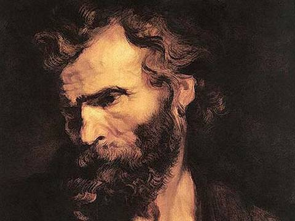

Der Judasbrief

{width="11.227cm"
height="8.421cm"}

Verfasser: Judas,

Bruder des Jakobus (Jakobusbrief),\
Halbruder von Jesus. (Mt. 13,55; Mk 6,3)

Zeitpunkt der Verfassung:

Vermutlich kurz vor 70 n.Chr.

Judas beleuchtet die Situation, wovor Petrus in 2. Petrus 2 gewarnt
hatte, das sie kommen wird. Die Infiltration durch fleischlich &
seelisch Gesinnte & Irrlehrer, ist jetzt beim Judasbrief bereits im
Gange.

**Thema: **

Kampf für den vollständig überlieferten,

heiligen Glauben

**Judasbrief**\

Dieses Buch: Der Judasbrief ist Teil von:\
Original **A**ramäisch Peshitta

**N**eues **T**estament **D**eutsch

übersetzt auf Grundlage des aramäischen Urtextes,

der Sprache von Jesus und seinen Jüngern und Aposteln.

unrevidierte Version, ergänzt v 0.1; April 2025

Lucien Jamin

Dank teilweise erweitertem (amplifiziertem) Text, den vielen wertvollen
erklärenden Fussnoten und Parallelstellen ist dieses Neue Testament auch
sehr gut als schlichte, klare unkomplizierte lebendige, geistbetonte
Studienbibel geeignet.

© Copyright Lucien Jamin

Darf unverändert und mit Quellenangabe nur vollständig mit Vorwort,
Fussnoten und Nachwort, für nicht kommerzielle Zwecke kopiert und
vervielfältigt werden!

Der Bibeltext darf für Predigten aller Art verwendet und zitiert
werden.\
Zitierte Bibelvers-Zitate sollen das Kürzel für diese Übersetzung haben:

ANTD oder ANTD-J ( **A**ram. **NT** ** D**eutsch Jamin)

Kontakt: Telegram: [https://t.me/SteinSchleuder
](https://t.me/SteinSchleuder) X:
[x.com/Jesus4you_ch](https://x.com/Jesus4you_ch)\
Kanal: [*https://t.me/KingJesusNews*](https://t.me/KingJesusNews)
Website: [*http://jesus4you.ch*](http://jesus4you.ch/)

Du kannst finanziell bei diesem wichtigen Übersetzungs-Projekt
mithelfen:

[https://paypal.m](https://paypal.me/pools/c/8r20kdJyrz)[e/pulsar](https://paypal.me/pools/c/8r20kdJyrz)
oder mit <https://www.buymeacoffee.com/LJamin>

Cryptos: **Monero:
**45kiETRcypfWDGN9wpyuv9Zr4HACJLhU9TYeRvLcN8FyTtLwbjA3VWGWPfojezornmMS53jaWzznRMZmFMnLsibsAAmY2iX

**Kaspa \$Kas** oder Mambo Coins wie \$Jesus \$Yeshua \$Franc, \$Gold
auf:

kaspa:qz37adqfvfrlae29mgnxjgvfeulcz2t3d85h5fyutzgzzsqdsfglv328jhnmm

\-\-\-\-\-\-\-\-\-\-\-\-\-\-\-\-\-\-\-\--\
**Hier wird der aktuelle Stand des Übersetzungsprojekts veröffentlicht
und\
übersetzte Teile als PDF zum Gratis Download angeboten:**

<https://jesus4you.ch/content/aramaeisch-urtext-deutsch-nt/>

Judasbrief

1\] Judas, ein Diener von Jesus, und ein Bruder von Jakobus,[^1] an die
von Gott dem Vater Berufenen aus den Nationen,[^2] welche in Jesus dem
Messias bewahrt werden.

2\] Barmherzigkeit und Frieden und Liebe werde euch vervielfacht!

3\] Geliebte, während ich alle Sorgfalt anwende euch über unser
gemeinsames Leben [^3] zu schreiben, so ist es notwendig, euch so zu
schreiben, dass ich euch davon überzeuge, **dass ihr für den Glauben
kämpft,[^4] welcher den Heiligen[^5] anfangs vollständig überliefert
wurde.**

4\] Denn es haben Menschen Eingang erlangt, über welche zum voraus von
Anfang an dieses Schuld Urteil geschrieben wurde: Böse Menschen, welche
die Gnade Gottes pervertieren durch Beschmutzung[^6], und sie verleugnen
*dadurch* den, welcher der alleinige Herr Gott ist und unseren Herrn
Jesus den Messias. (2. Petrus 2.)

5\] Ich will euch e*infach* daran erinnern, wie ihr alle wisst, dass
Gott zwar einst das ganze Volk aus Ägypten gerettet hat, aber nachher
diejenigen zerstörte, welche nicht glaubten.

6\] Und die Engel[^7], welche ihren Herrschaftsbereich nicht bewahrten,
sondern ihre eigene Behausung verliessen, die hält Er in Ketten
gefangen, unbekannt unter der Finsternis, für den grossen Tag des
Gerichts. (1. Mose 6:4 Nephilim; 2.Petr.2,4; Offb. 9, 2.11.15; 1. Buch
Henoch)

7\] In gleicher Weise auch Sodom und Gomorrha und die umliegenden
Städte, welche in gleicher Weise Unzucht getrieben haben und **anderem
Fleisch nachgingen**[^8]. Da sie zum Gericht verurteilt wurden, sind sie
unter die Demonstration[^9] des ewigen Feuers gestellt worden.

8\] In gleicher Weise auch die, welche in Träumen in Lust verwickelt
werden[^10], beschmutzen ihr Fleisch und ignorieren (verachten)
Herrschaft und lästern die Herrlichkeit. [^11] (Matth. 5,28; 15;18-20)

9\] Wenn sogar der Erzengel Michael, als er mit dem teufel über den Leib
des Moses sprach[^12], nicht wagte, ein lästerndes Urteil gegen ihn zu
fällen, sondern sprach: Der Herr YAH schelte dich. (Dan. 10,13ff; Offb.
12,7-12; Sach 3,2; )

10\] Und diese *Menschen *lästern über solche Dinge, welche sie nicht
kennen,[^13] aber worin sie von Natur aus überzeugt sind wie stumme
Tiere, davon werden sie gefesselt.

11\] **Wehe**[^14] diesen, denn sie sind auf dem Weg Kains^a[^15]^
gegangen, sind dem Irrtum Bileams nach Gewinn nachgeeifert[^16], und
sind in der Rebellion Korahs^b^ umge-kommen. (^a^1.Mose 4; ^b^4.Mose 16)

12\] Diese sind solche, welche sich in ihrer Freizeit leichtsinnig und
übermässig beschmutzen, sie weiden sich ohne Furcht. Wolken ohne Regen,
welche von den Winden verweht werden, Bäume, die verdorrt sind, die
keine Frucht brachten, zweimal gestorben, sie sind ausgerissen aus ihren
Wurzeln.

13\] *Sie sind *tobende Wellen des Meeres, welche ihre Peinlichkeiten
ausschäumen, wandernde Sterne, für welche die dunkle Schwärze der
Finsternis für immer reserviert ist.

14\] Über diese hat auch **Henoch** prophezeit, der siebte von Adam an,
als er sagte:[^17] \"*Siehe der Herr YAH kommt mit Zehn Tausenden seiner
Heiligen.[^18] (Offenbarung 19: 11-16)*

*15\] um Gericht zu üben an allen, und um jede Seele zu bestrafen wegen
ihrer Werke, wegen der Bosheit, und wegen all der harten Worte, welche
diese bösen Sünder gesprochen haben.\"*[^19]

16\] Dies sind solche, **welche über alle Dinge murren und sich
beklagen**, während sie nach ihren Begierden wandeln, und ihr Mund
spricht stechende Dinge, und sie schmeicheln Personen für Profit.

Massnahmen gegen Infiltration der Gottlosen

17\] **Ihr aber**, meine Geliebten, erinnert euch an diese Worte, welche
zuvor gesprochen wurden durch die Apostel[^20] unseres Herrn JESUS dem
Messias.

18\] Diese haben euch gesagt, dass in der letzten Zeit (Endzeit),[^21]
solche sein werden, welche spotten und welche der Bosheit folgen nach
ihren eigenen Begierden.[^22]

19\] Dies sind solche, welche die Seele in den Mittelpunkt setzen[^23],
denn **sie haben den Geist nicht**.[^24]

**20\] Ihr aber, meine Geliebten, baut euch von neuem[^25] auf in eurem
heiligen Glauben, während ihr im Heiligen Geist betet.[^26] **(Eph.
6:19-22)

21\] Aber lasst uns unsere Seele **in der Liebe zu Gott bewahren**,
während wir auf die Barmherzigkeit unseres Herrn JESUS dem CHRISTUS
warten, für unser ewiges Leben.

22\] Und einige von denen, greift sie aus dem Feuer. [^27]

23\] Und wenn sie Buße tun, habt erbarmen mit ihnen mit Furcht, da ihr
auch den Mantel hasst, welcher vom Fleisch befleckt ist.

24\] Ihm, der fähig ist uns zu bewahren, dass wir nicht fallen, und dass
wir ohne Beschmutzung und ohne Makel stehen.

25\] Er alleine ist Gott, unser Retter

durch Jesus, den Messias, unseren Herrn,

seine Pracht & Herrlichkeit geht voraus in Freude.

Ihm sei die Herrlichkeit, die Herrschaft, die Ehre und die Majestät, nun
und für alle Zeitalter.

Amen.

{width="12.882cm"
height="7.246cm"}

Zusammenfassung Judasbrief:

Wir sollen für den anfänglich vollständig überlieferten Glauben kämpfen.

Böse Menschen infiltrierten christliche Kreise und verleugnen Jesus
unsern Herrn und Gott den Vater durch:

Fleischlichkeit, ein Leben in Begierden, Irrlehren, Unverständnis,
Unwissenheit, Lästerung, Missachtung der Herrschaft und Herrlichkeit,
Rebellion, Unglaube, lockeren Umgang mit Sünde, Böses Herz, unreine
Träume, keine Disziplin, Hedonismus, Unzucht, Sodomie, Verseuchung mit
fremden Fleisch, heute ist dies auch mRNA Verseuchung, Geldgier,
Falschheit und Schmeicheln für Profit, Kompromisse mit dem Wort Gottes,
böse Worte, Murren & Klagen, Spötter, ohne Kraft, gefangen in
animalischen Begierden, rein seelisch, natürlich, ohne den Geist.

Dies alles steht dem Heiligen Glauben entgegen.

Wir überwinden dies, indem wir allezeit im Heiligen Geist beten und so
von neuem aufgebaut werden, indem wir durch den Geist getränkt werden im
heiligen reinen Glauben und unser Herz reinigen, und indem wir uns
Fernhalten von den Lügenmedien und gottlosem Reden und die Begierden
fliehen.

Fussnoten:  

[^1]:  zu Vers 1: *Bruder des Jakobus:* Jakobus, der Verfasser des
    Jakobusbriefs. Jakobus und Judas waren Halbbrüder (oder Stiefbrüder)
    von Jesus, die sich nach der Auferstehung von Jesus bekehrt haben.
    Sie waren nicht unter den 12 Aposteln.

[^2]:  Vers 1: *Judas, ein Diener von Jesus, und ein Bruder von
    Jakobus*, *an die von Gott dem Vater Berufenen aus den Nationen,
    welche in Jesus dem Messias bewahrt werden.*

    Nationen (Heiden) fehlt im Griechischen. Der aramäische Judasbrief
    hat also einen klaren Adressat: Die Heidenchristen. Judas konnte die
    Judenchristen in Judäa und Galiläa direkt in Person erreichen. Der
    Brief soll eine weite Verbreitung finden, was für den
    missionarischen, strategischen, kämpferischen, fürsorglichen,
    feurigen Geist von Judas zeugt.

[^3]:  Vers 3: *Geliebte, während ich alle Sorgfalt anwende euch über
    unser gemeinsames **Leben** zu schreiben, so ist es notwendig, euch
    so zu schreiben, dass ich euch davon überzeuge, **dass ihr für den
    Glauben kämpft****, welcher den Heil****i****gen ****anfangs
    ****vollständig**** ****überliefert wurde.***

    Griechisch übersetzt Leben meistens mit Errettung. Dies ist nur ein
    Aspekt des göttlichen Lebens, das diejenigen empfangen, welche an
    Jesus Glauben und von Gott von neuem geboren werden (Joh. 1,12, Joh
    3,16). Das Aramäische behält die Betonung auf das Leben, was im
    Griechischen abgeschwächt wird mit dem Wort Errettung. Die göttliche
    Errettung passiert \"organisch\" durch das neue Leben im Geist,
    nicht nur äusserliche oder juristisch. Indem wir ein Leben im Geist
    führen, nicht im Fleisch, wird unsere Seele mehr und mehr erneuert
    und errettet. (Röm. 12.2, []{#anchor}Phil 2.12: .. umso mehr bewirkt
    das Werk eures **Lebens** in Furcht und Zittern.)

[^4]: ** Vers 3: *****dass ihr ****für den Glauben kämpft****,****
    welcher den Heil****i****gen ****anfangs ****vollständig****
    ****überliefert wurde****. ***

    Es gibt keine Passivität oder Neutralität. Wer nicht für den reinen
    wahren Glauben kämpft, wird ihn verlieren und grossen Schaden
    erleiden.

[^5]: ** *****welcher den ****Heil****i****gen**** ****anfangs
    ****vollständig**** ****überliefert wurd****e.***

    Geheiligte, alle Gläubigen, die nicht abfallen vom Glauben

[^6]:  V4: *Böse Menschen, welche die Gnade Gottes pervertieren durch
    Beschmutzung*.

    Schändung: Den heiligen, reinen Glauben in Gott und Jesus durch
    schändliche Fleischlichkeit, Irrlehren, Kraft- und Geistlosigkeit
    entweihen.

[^7]:  Vers 6: *Und die Engel, welche ihren Herrschaftsbereich nicht
    bewahrten, sondern ihre eigene Behausung verliessen, die hält Er in
    Ketten gefangen, unbekannt unter der Finsternis, für den grossen Tag
    des Gerichts.*

    Die Nephilim in 1. Mose 6.4. Nicht zu verwechseln mit den Söhnen
    Gottes. Gott nennt Engel gemäss Hebr. 1,5 nicht seine Söhne. Die
    Söhne Gottes sind die Menschen der reinen Linie von Set im Gegensatz
    zu der Linie der Menschen von Kain, der die Sünde in seinem Herzen
    \"normalisierte\", anstatt über sie zu herrschen. Zu den Töchtern
    dieser Menschen (der Kain Linie) sind die Söhne Gottes eingegangen,
    verführt von den gefallenen Engeln, welche die Menschen zu sündigen
    beibrachten. Offenbarung 12. 5-17 beschreibt eindeutig eine andere
    Serie gefallener Engel, welche ja nicht in Finsternis in Ketten
    gebunden sind, sondern jetzt in dieser Zeit auf die Erde geworfen
    werden, nämlich je mehr Überwinder \"entrückt\" werden bzw.
    anfangen, in Himmlischen Sphären zu leben, während sie noch eine
    Weile auf Erden sind. Dies führt zu der Trennung, die wir sehen. Die
    Gottlosigkeit nimmt zu, während gleichzeitig der Überrest zur vollen
    Reife des Leibes Christi wächst in voller Kraft und Autorität von
    Jesus Christus.

[^8]:  Vers 7: *In gleicher Weise auch Sodom und Gomorrha und die
    umliegenden Städte, welche in gleicher Weise Unzucht getrieben haben
    und **anderem Fleisch**** nachgingen**. *

    Dies ist Homosexualität, Sodomie / Zoophilie (Verkehr mit Tieren),
    aber auch mit Hybriden und synthetisch \"biologischen\" Wesen. mRNA
    Impfungen und Nano Graphenoxid Teilchen, welche überall gestreut
    werden, hybridisieren die Menschen. **Sie haben dann nicht mehr eine
    menschliche DNA und werden zu fremden Fleisch.** Jesus warnte, dass
    es sein wird wie zur Zeit Noahs, wo sie sich auch hybridisieren
    liessen. Wir sind jetzt soweit, dass wir nicht mehr ohne weiteres
    mRNA Geimpfte heiraten sollten, erst recht nicht ausserehelichen
    Verkehr, um nicht das Urteil einzufangen, **fremden Fleisch**
    nachzugehen. Ab einer gewissen Anzahl mRNA Verseuchung kann es zu
    spät sein. mRNA ist patentiert, man tritt quasi das Eigentumsrecht
    über den Körper ab. Daraus entwickelt sich das Malzeichen des
    Tieres. Es ist wichtig, sich mit Chlorophyll zu entgiften.

[^9]:  Vers 7b:* Da sie zum Gericht verurteilt wurden, sind sie unter
    die Demonstration des ewigen Feuers gestellt worden.*

    Die zugeschütteten Kulissen sind bis heute deutlich sichtbar, und
    man findet schwefelhaltige grosse Körner, welche feurig herunter
    gefallen sind. Eine Mahnung an das ewige Feuer der Hölle.

[^10]:  Vers 8:* In gleicher Weise auch die, welche in Träumen in Lust
    verwickelt werden , beschmutzen ihr Fleisch \...*

    Judas zeigt wie Jesus, dass die unzüchtigen Sünden bereits im Herz
    anfangen. Ein Herz voller unreiner Gedanken, heutzutage leicht mit
    Pornographie und dämonischen Phantasiewesen (z.B. Avatar) gefüllt,
    produziert unreine beschmutzenden Träume. Es ist dringend ein 3x21
    Tages Training nötig und eine Entscheidung mit grosser
    Determination, um davon loszukommen und sein Herz rein zu
    programmieren. Siehe Trainings auf jesus4you.ch. Lies auch: Das Herz
    von Reinhard Hirtler.

[^11]: * Verse 8-10: \... beschmutzen ihr Fleisch und **ignorieren
    (verachten) Herrschaft und lästern die Herrlichkeit**.*

    Griechisch übersetzt mit Plural \"Herrlichkeiten\" was dann zu
    Verwirrung und falschen Interpretationen geführt hat. Aramäisch
    schreibt genau wie in Mt. 6,13: Herrlichkeit, Singular.

    Vergleiche: 2.Petrus 2,10 Speziell diejenigen, welche dem Fleisch
    nachgehen in Begierde der Befleckung, und sie sind in fleischlicher
    Verachtung gegen die Herrschaft, respektlos und arrogant, welche vor
    der Herrlichkeit nicht zittern, wenn sie lästern.

    11\] Wenn doch die Engel, welche in Macht und Stärke grösser sind
    als sie, kein Urteil der Lästerung über sich selbst bringen vom
    Herrn Yah.

    12\] Aber diese, welche wie die stummen Tiere von Natur für die
    Schlachtung und Vernichtung sind, so wie sie über diese Dinge,
    welche sie nicht kennen lästern, werden sie durch ihre Verdorbenheit
    zerstört werden.

    Es ist nicht leicht, herauszufinden, was Judas (und Petrus) genau
    sagen wollten, was sich in verschiedenen Auslegungen widerspiegelt.
    Deshalb habe ich sorgfältig versucht, es möglichst genau oder
    sinngemäss zu übersetzen.

    Judas und Petrus nehmen hier das Verhalten von Erz-engel Michael zum
    Vergleich.

    Dem Lügner, Mörder und Zerstörer satan, den gefallenen Engeln oder
    Dämonen gebührt aus menschlicher Sicht keine Ehre, wie es Jesus der
    Menschensohn demonstriert hat, auch Paulus (Kol. 2,15.18). Es ist
    aber kein Platz für Anmassung, Arroganz, Überheblichkeit oder
    Leichtsinn. Wir müssen wachsam sein und respektieren, dass satan
    schlau, böse, unnachgiebig, gewissenlos, gnadenlos, unbarmherzig,
    ein brutaler Narzisst ist, der umher geht wie eine brüllender Löwe
    und sucht, wen er verschlingen kann, mit einem Ziel, den Menschen
    als Ebenbild Gottes zu zerstören und für sich Anbetung und Ehrfurcht
    zu gewinnen. Wenn wir in Sünde leben oder im Selbst, im Seelenleben,
    verlassen wir das Terrain des Sieges von Jesus. Es findet ein
    geistlicher Krieg statt. Fleischlichkeit, Sünden, insbesondere
    sexuelle Ausschweifungen oder Perversionen verachten Gottes
    Herrlichkeit, Ordnung, Natur und Gesetzte, und wenn da9zu noch
    gescherzt und gelästert wird, zeigt dies, dass die Ernsthaftigkeit
    der Verdorbenheit ignoriert wird, und auch das Zerstörungspotential
    des Feindes wird ignoriert. Tolerierte Sünde und Fleischlichkeit
    gibt dem Feind einen Angriffspunkt. Es ist nicht angebracht, über
    den teufel, die gefallenen Engel oder Dämonen leichtsinnig zu
    scherzen. satan ist ein gefallener Cherub, er hatte die Herrlichkeit
    Gottes beschirmt.

    Wir beten Mt. 6.13: *Denn dein ist die Herrlichkeit in Ewigkeit. *Es
    geht um Gottes Herrlichkeit, da sie nur ihm gebührt. Herrlichkeit
    lästern bedeutet, Gottes Herrlichkeit und Ordnung zu lästern. Dass
    Michael es nicht wagte, ihn direkt zu tadeln, hat wohl damit zu tun,
    dass er ihm vor dem Fall unterordnet war. Nach Daniel 10 und
    speziell Offb. 12,7-12 ist Michael und seine Engel im schweren
    direkten Kampf mit satan und dessen Engel. Dieser Kampf wird
    massgeblich davon entschieden, dass die \"Brüder\" ihn überwunden
    haben. Die Engel Gottes warten darauf, bis wir Menschen auf Erden
    den Willen Gottes im Gebet und Dekreten aussprechen und tun. Sie tun
    nur den Willen Gottes, und ob dieser geschieht, hängt massgeblich
    vom Gebet von Gottes Volk, heute der Ekklesia ab. Um den Leichnam
    des Moses zu begraben, war vermutlich kein Mensch in Fürbitte, und
    Michael musste direkt den HERRN aufrufen, um die Intervention satans
    abzuhalten. (Dan. 10,21). Engel Gottes kennen ihre Grenzen und
    handeln nicht in Anmassung oder eigener Einschätzung, auch nicht auf
    eigensinnige Befehle von Menschen.

    Der Mensch als Ebenbild Gottes in Gemeinschaft mit Gott war
    ursprünglich nicht niedriger als die Engel. Erst der Sündenfall
    brachte ihn in Konfrontation mit dem Willen und der Natur Gottes,
    und unter die Vergänglichkeit und so **unter** die Engel, welche
    Gottes Willen ausführen. Gefallene Engel und Dämonen halten die Welt
    in Finsternis und Verführen zur Sünde. Das ganze steht hier direkt
    im Zusammenhang mit sexuellen Sünden (*beschmutzen ihr Fleisch*),
    welche nicht die Herrlichkeit und Ordnung Gottes respektieren, dass
    Gott den Menschen in seinem Bild als Mann und Frau gemacht hat, und
    nur die zwei sollen ein Fleisch sein. Wenn wir solche
    Schöpfungs-Ordnungen Gottes missachten, verachten wir die
    Herrschaft. Auch Homosexualität bzw. Sodomie bedeutet Verachtung von
    Herrschaft und lästern von Gottes Herrlichkeit. Dies ist mit ein
    Grund, dass sie unter Freimaurern, satanisten und korrupten
    Politikern so verbreitet und gepuscht wird, um satans zerstörerische
    Agenda voran zu treiben.

    Unser **Körper ist der Tempel des Heiligen Geistes,** deshalb ist
    Unzucht und Sodomie sowieso eine Verrachtung von Herrschaft und
    Herrlichkeit.

    Gottes Herrschaft, Befehlslinie ist: Wir sind alle Jesus Christus
    als Haupt unterordnet. Jede Gewalt, Herrschaft und Macht und jeder
    Name muss Christus unterordnet werden. In der Ekklesia ordnen wir
    uns einander unter und achten auf den Heiligen Geist. Das heisst,
    wir üben uns darin, zu erkennen, wenn der Heilige Geist durch andere
    spricht, selbst wenn sie in den Augen der Menschen \"niedrig\" oder
    gering geachtet sind. Zudem respektieren wir Älteste unserer Gruppe.
    Wenn wir uns Gott unterordnen haben wir im Heiligen Geist im Namen
    Jesus im Willen Gottes als Ekklesia Autorität über die Mächte der
    Finsternis. Persönlich haben wir in Christus Autorität über die
    unreinen Dämonen, (welches die entkörperten Geister derer sind, die
    bei der Sintflut umkamen, die sind Erdgebunden. Die Geister unter
    dem Himmel habe ein ganz anderes Gewicht und sind territoriale
    Fürsten. Hier müssen wir als Ekklesia handeln. Mehr dazu im Buch:
    satans grösster Alptraum, Ekklesia, die Exekutiv Versammlung des
    Messias Königs Jesus.

[^12]:  Vers 9: *Wenn sogar der Erzengel Michael, als er mit dem teufel
    über den Leib des Moses sprach\...*

    Dieses Ereignis ist im Alten Testament nicht überliefert. In
    Sacharja 3,2 ist ein ähnliches Ereignis, als der Hohepriester Josua
    (Yeshua) in den Himmel entrückt wurde. Um die Anklagen satans
    abzuwehren, wurden ihm reine Kleider der göttlichen Rechtfertigung
    angezogen.

[^13]:  Vers 10: *Und diese Menschen lästern über solche Dinge, welche
    sie nicht kennen, aber worin sie von Natur aus überzeugt sind wie
    stumme Tiere, davon werden sie gefesselt. *

    *1. Korinther 2,14 Der natürliche Mensch aber nimmt nicht an, was
    vom Geist Gottes ist; denn es ist ihm eine Torheit, und er kann es
    nicht erkennen, weil es geistlich beurteilt werden muss. 15 Der
    geistliche \[Mensch\] dagegen beurteilt zwar alles, er selbst jedoch
    wird von niemand beurteilt;*

    Der Judasbrief kristallisiert klar heraus, dass der natürliche,
    seelische Mensch im Gegensatz steht zum Mensch des Geistes des
    Glaubens. Dieses natürliche, seelische Menschliche ohne den Geist
    Gottes in die Versammlung zu lassen, ist die Endzeit Infiltration.
    Es öffnet das Tor zu Unmoral, Kompromisse, Irrlehren, Weltlichkeit
    und Hybridisierung.

[^14]:  Vers 11: ***Wehe** diesen, denn sie sind auf dem Weg Kains
    gegangen \...*

    Judas ist der Erste (und letzte) Briefschreiber des NT, der das Wort
    **Wehe** verwendet, welches Jesus oft gegen die Pharisäer und
    Schriftgelehrten verwendet hat, und sie als Schlangenbrut bezeichnet
    hat (Same der Schlange, siehe 1. Mose 3:15). Diese Schlangenbrut
    hatte sich fest in das religiöse Judentum eingenistet und versucht,
    die Menschen von Jesus abzuhalten und hat Jesus gekreuzigt. Ca. 40
    Jahre nach Jesu Himmelfahrt und Beginn der Gemeinde, des Leibes
    Christi, durch die Ausgiessung des Heiligen Geistes, fängt diese
    Schlangenbrut an, sich ins frühe Christentum einzunisten, und hat es
    seither nicht mehr verlassen. Deshalb das Wehe.

[^15]:  Vers 11: *Wehe diesen, denn *

    ***sie sind ****auf dem Weg**** Kains ****gegangen**** **\...*

    **Der Weg Kains:** 1. Mose 4: Vom erstgeborenen Sohn Adams zum
    verfluchten Mörder. satan fürchtete, dass einer der beiden ersten
    Söhne Adam & Evas der verheissene Messias sei, der ihm, der
    Schlange, den Kopf zertreten werde. Als Abel ein Blutopfer brachte,
    welches Gott wohlgefällig war, zeigte Abel damit, wie ernsthaft er
    die Sünde nahm, Buße tat und Vergebung suchte. Kains Opfer war
    blutlos, was zeigte, dass er mit Sünde locker umging und Sühne durch
    Blutvergiessen nicht nötig fand. satan stachelte ihn an, seinen
    Bruder, (den vermeintlichen Messias) umzubringen. Gott probiert Kain
    noch persönlich davon abzuhalten, auf diesen Weg der Schlange zu
    geraten: 1. Mose 4: *6 Und der Herr sprach zu Kain: Warum bist du so
    wütend, und warum senkt sich dein Angesicht? 7 Ist es nicht so: Wenn
    du Gutes tust, so darfst du dein Haupt erheben? Wenn du aber nicht
    Gutes tust, so lauert die Sünde vor der Tür, und ihr Verlangen ist
    auf dich gerichtet; du aber sollst über sie herrschen! 8 Und Kain
    redete mit seinem Bruder Abel; und es geschah, als sie auf dem Feld
    waren, da erhob sich Kain gegen seinen Bruder Abel und schlug ihn
    tot.*

    Dies zeigt: Wenn wir uns auf Gutes tun fokussieren und suchen, mit
    einem reinen Gewissen mit Gott Gemeinschaft zu haben, haben wir kaum
    Zeit oder Raum für Stolz, Groll, Hass, Eifersucht, Selbstmitleid,
    Unzucht, übermässige Trauer. Wenn wir nicht Gutes tun, lauern diese
    Dinge vor der Herzenstür und wir können nicht über sie herrschen.
    Wenn wir nicht aufpassen, was in unser Herz kommt und bleibt, und
    Sünde rechtfertigen, werden wir schnell zum

    Samen der Schlange = Weg Kains.

[^16]:  Vers 11: *sind dem Irrtum Bileams nach Gewinn nachgeeifert.. *

    Wegen Geld Kompromisse machen im Predigen von Gottes Wort. Alle
    bezahlten Pastoren, Prediger, Pfarrer, Priester, Propheten, Autoren
    sind schon mit einem Bein im Irrtum Bileams. Wer riskiert schon
    seinen Job, indem er die Wahrheit sagt, das was Gott will, und nicht
    das was die Zuhörer oder Lohnzahler wollen.

[^17]:  Vers 14 & 15: *Über diese hat auch **Henoch** prophezeit, der
    siebte von Adam an, als er sagte: \"Siehe der Herr YAH kommt mit
    Zehn Tausenden seiner Heiligen. (Offenbarung 19: 11-16)*

    15\] um Gericht zu üben an allen, und um jede Seele zu bestrafen
    wegen ihrer Werke, wegen der Bosheit, und wegen all der harten
    Worte, welche diese bösen Sünder gesprochen haben.\"

    Dies ist ein direktes Zitat aus dem ausserbiblischen, apokryphen
    1.Buch Henoch. Das Buch ist lesenswert, aber enthält Ungenauigkeiten
    und Irrtümer. Nur Bruchstücke davon stammen wirklich von Henoch. Es
    gehört berechtigterweise nicht zum Kanon der inspirierten Bibel.

[^18]: * Vers 14&15: *Siehe der Herr YAH kommt mit **Zehn Tausenden
    seiner Heiligen**. \...

    Diese *ur*alte Prophetie von Henoch geht in Offenbarung 19*,11-16*
    in Erfüllung. *\"Seine Heiligen\" sind d*ie Heerschar*en* in
    ***weissen Leinen***, welche Jesus auf dem weissen Pferd folg*en.
    Das *sind nicht Engel, siehe Fussnoten zu Offb.19.* Aber nach Mt.
    24,31 sammeln Engel bei der Wiederkunft die Auserwählten und nach
    Mt. 25,31 kommt Jesus in seiner Herrlichkeit begleitet von allen
    heiligen Engeln. Jesus kommt mit Engeln und Heiligen. Dies zeigt
    unsere Verantwortung als Heilige, die Dekrete Gottes jetzt zu
    sprechen und das Schwert Jesus aus unserem Munde ausgehen zu lassen,
    um die Werke der Bosheit zu zerstören.*

[^19]:  Vers 15: \...*und wegen all der harten Worte, welche diese bösen
    Sünder gesprochen haben. *

    Durch Mainstream Lügenmedien und TV Spielfilme und Serien werden wir
    konstant mit diesen bösen harten Worten der Gottlosen überschüttet.
    Ausschalten. Buße tun. Herr Jesus, vergib uns all diese bösen Worte,
    die wir unbescholten in unser Herz liessen. Gib uns einen Geist der
    Furcht Gottes. Wir entscheiden uns jetzt, uns nicht mehr hemmungslos
    überschütten zu lassen von Medien. Amen.

[^20]:  Vers 17:* **Ihr aber**, meine Geliebten, erinnert euch an diese
    Worte, welche zuvor gesprochen wurden durch die Apostel unseres
    Herrn JESUS dem Messias.*

    Dies ist heute das Neue Testament. Der Judasbrief ist der letzte
    Brief im Neuen Testament und sagt schön, dass man alle vorherigen
    lesen und hören soll. Wir müssen beständig in der Lehre der Apostel
    bleiben und uns mit dem Wort Gottes sättigen, um die Verführungen
    und Herausforderungen der Endzeit zu meistern.

[^21]:  Vers 18: *Diese haben euch gesagt, dass in der letzten Zeit
    (Endzeit), solche sein werden, welche spotten und welche der Bosheit
    folgen nach ihren eigenen Begierden.*

    Ab Judasbrief sind wir in der Endzeit, welche mit dieser
    Infiltration anfing.

[^22]:  Vers 18b: \... *der Bosheit folgen nach ihren eigenen
    Begierden.*

    Das NT betont noch und noch, dass nach den Lüsten und Begierden
    leben, fleischlich gesinnt sein, Feindschaft zu Gott ist. Begierde
    höhlt den Glauben aus. Petrus sagt, dass wir dem Verderben
    entfliehen müssen, welches durch die Begierden in der Welt ist. Wer
    dies auf die leichte Schulter nimmt, zeigt damit, dass er bereits
    gefährlich infiltriert ist!

[^23]:  Vers 19:* Dies sind solche, welche die Seele in den Mittelpunkt
    setzen, denn sie haben den Geist nicht.*

    wörtlich: Seele, Seelenleben trennen

[^24]:  Vers 19: *Dies sind solche, welche die Seele in den Mittelpunkt
    setzen , denn sie haben den Geist nicht.*

    Lamsa interpretiert: These are those who prefer to associate with
    selfish people because they do not have the Spirit in them.

    Man trennt die Seele und kümmert sich nur um seelisches,
    natürliches, indem alles geistliche aus dem Leben ausgeklammert
    wird, kein Gebet, kein Wort Gottes, kaum Dankbarkeit gegenüber Gott,
    weil man den Geist Gottes nicht hat. Dies beschreibt einen Grossteil
    des gefallenen westlichen Namens- christentums. Man übernimmt nur
    gewisse moralische Werte und missbraucht die Freiheit, aber die
    Person Jesus unseren Herrn, und damit Gott, wird aus dem Leben
    ausgeklammert. Man ist nicht wiedergeboren durch Buße, Umkehr und
    Glauben, noch gefüllt mit dem Heiligen Geist.

[^25]:  **Vers 20: ***Ihr aber, meine Geliebten, *baut euch von neuem
    auf in eurem heiligen Glauben*, während ihr im Heiligen Geist
    betet.*

    von neuem aufbauen: Durch Gebet im Geist bauen wir uns von neuem
    auf**, den Neuen Menschen in Christus**, indem wir durch den Geist
    völlig getränkt werden mit dem heiligen Glauben**, welcher auf die
    Leinwand unseres reinen Herzens gemalt wird.**

[^26]:  Vers 20: Ihr aber, meine Geliebten, baut euch von neuem auf in
    eurem heiligen Glauben, während ihr im Heiligen Geist betet.

    Dies ist der Schlüsselvers vom Judasbrief. **Wir bewahren den
    heiligen Glauben dadurch, dass wir beständig im Geist beten.
    **Allezeit im Geist beten, was speziell gut geht durch das Beten in
    Zungen, wo der Heilige Geist betet. Siehe auch Römer 8.26, 1. Kor.
    **14, 2&4 (*****der **erbaut** sich *****selbst, gleiches Wort wie
    in Judas). Dies baut unseren Glauben auf. Mangel an Glauben ist
    Mangel an echtem Gebet. Sogenanntes \"Zungenreden\", wovon ein Teil
    das persönliche Gebet in Zungen (in einer unbekannten Sprache) ist,
    abzulehnen oder vernachlässigen, geht direkt einher mit dem Mass des
    Unglaubens in solchen Kreisen. Sie vertrauen eher ihrem Verstand,
    der verlogenen Medizin oder dem satanischen Staat, anstatt Gott
    hinsichtlich Gesundheit und Heilung. Glaube versetzt Berge. Glaube
    zieht die geistlichen Dinge, alle Verheissungen Gottes, welche wir
    durch Hoffnung sehen und aufs Herz schreiben, in unsere
    physikalische Welt und Erfahrung.**

[^27]:  Vers 22: *Und einige von denen, greift sie aus dem Feuer.*

    Wie greifen wir Menschen aus dem Feuer? Da Judas uns das nicht sagt,
    ausser dass wir dabei vorsichtig sein sollen, nicht selber
    beschmutzt zu werden, lasst uns im Gebet darüber nachdenken und um
    Weisheit und Führung bitten, wie wir Menschen aus dem Feuer retten
    können. Z.B. diesen Judasbrief ausdrucken und weitergeben oder auf
    Socialmedien teilen mit einer Empfehlung. Aber insbesondere dadurch,
    dass wir uns authentisch um Mitmenschen kümmern, für sie beten,
    Gutes tun, und uns nicht scheuen, in Liebe die Wahrheit zu sagen.
    Wenn sie krank sind, im Glauben die Hände auflegen und Heilung im
    Namen Jesus befehlen. Wenn sie in Not sind, materiell helfen, und so
    ihr Herz gewinnen und für Jesus öffnen.
